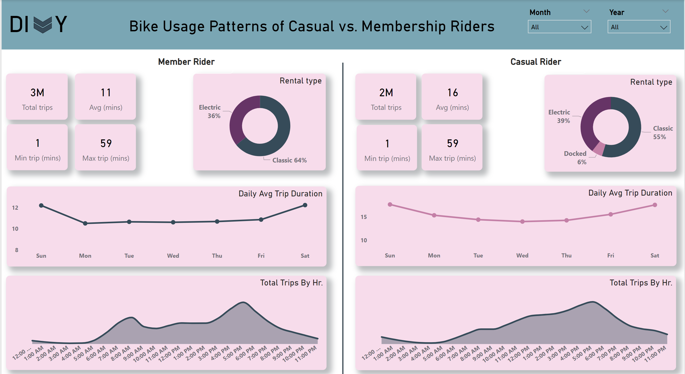

# Google Data Analytics Capstone: Cyclistic Case Study

## Introduction

In this case study, I will perform many real-world tasks of a junior data analyst at a fictional company, Cyclistic. In order to answer the key business questions, I will follow the steps of the data analysis process: Ask, Prepare, Process, Analyze, Share, and Act.

### Power BI Concepts Applied

- Dax Concepts: Calculated columns,Custom Columns
- Data Modeling: Single table

### Problem Statement

How do annual members and casual riders use Cyclistic bikes differently?

### Business Task

Devise marketing strategies to convert casual riders to members.

### Data Source

I used Cyclistic’s historical trip data to analyze and identify trends from Oct 2022 to Oct 2023 which can be downloaded from divvy_tripdata. 

### Combining the Data

I used power query to combine the 12 csv files

### Data Transformation/Cleaning

- All the rows having missing values were deleted.
- Extracted Month of year, Day of week and Year from the started_at column 
- Performed analytca ttramsformation of the dataset by adding a custom column "trip Duration"
- Trips with duration less than a minute and longer than a day are excluded.
- A Total 1,375,912 rows were removed in this step.
- Created a month order and day order column to assist with visualization of the data

  
### Analyze

Bike Usage Patterns of Casual vs. Membership Riders report from Oct 2022 - Oct 2023 

  
 
