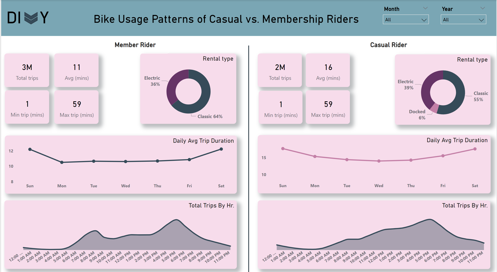

# Google Data Analytics Capstone: Cyclistic Case Study

## Introduction

In this case study, I will perform many real-world tasks of a junior data analyst at a fictional company, Cyclistic. In order to answer the key business questions, I will follow the steps of the data analysis process: Ask, Prepare, Process, Analyze, Share, and Act.

### Power BI Concepts Applied

- Dax Concepts: Calculated columns,Custom Columns
- Data Modeling: Single table

### Problem Statement

How do annual members and casual riders use Cyclistic bikes differently?

### Business Task

Devise marketing strategies to convert casual riders to members.

### Data Source

I used Cyclistic’s historical trip data to analyze and identify trends from Oct 2022 to Oct 2023 which can be downloaded from [divvy_tripdata](https://divvy-tripdata.s3.amazonaws.com/index.html). 

### Combining the Data

I used power query to combine the 12 csv files

### Data Exploration

### Data Transformation/Cleaning

- All the rows having missing values were deleted.
- Extracted Month of year, Day of week and Year from the started_at column 
- Performed analytca ttramsformation of the dataset by adding a custom column "trip Duration"
- Trips with duration less than a minute and longer than a day are excluded.
- A Total 1,375,912 rows were removed in this step.
- Created a month order and day order column to assist with visualization of the data

  
### Analyze

Bike Usage Patterns of Casual vs. Membership Riders report from Oct 2022 - Oct 2023 

Here, we can discover a few insights:
- Out of the total 5 million trips, members had 3m of those trips and casual riders had 2m.
- The avg trip duration for members was 12mins while that of casual riders was 16mins.
- Both rider types had a min trip duration of 1min minimum and a maximun of 59mins.
- The rental type donut chart shows the bike rental prefrence of each rider type. Here we notice that Classic bikes bikes are the most preferred, then followed by classic bike for both rider types, but casual 
  riders also use docked bikes though it's the least preffered as compared to no docked bikes used at all for membership riders.
- Looking at the Daily Avg trip duration, we notice that both riders have the longest trip duration on Saturdays and Sundays.
- The total trips by hr area chart shows us that member riders have two peak hours 8am and 5pm, while casual riders have a steady increase starting from 7am and peak at 5pm
- Mon-Fri with peak hours at 8am and 5pm are the most popular amongts member riders, while Thurs-Sun are more common amongst Casual rider. Common hours from Thurs- Fri are 12pm-7pm and on Sat - Sun peak hours are 
  10am-7pm.

Using the Lat and Long data points provided in the dataset, I was able to generate a map showing us the start station with the most trip durations.
I used start stations because the end station points provided a nearly indentical visual to that of the start station so the insights generated from both were thesame.

The grey circles on the map represent the stations, the larger the raduis of that circle the more the total trips were taken from that particular station.

- We noticed that stations in the inner part of the city were more popular amongst member rider, while those in the coastal part of the city were more popular amongst casual riders.
- Zooming in further into the maps, we realized the stations located closer to the universities and around the downtown areas were used by a majority of member riders, while those closer to muesems and parks were 
  used by a majority of the casual riders.

  

- The visual above shows us a zoomed in image of the station with the most trips, we notice that stations around the Univervity of Chicago school of medicine and the main camous of the University of Chicago had 
  the station with member rider trips, while the stations around Gateway park and the Chicago Lakefront trail was more popular amongst the casual riders.

  ### Recommendation

- Weekend Membership Promotions: Consider weekend specific membership plans or bonuses that align with the common hours on Thurs-Fri and Sat-Sun.
- Enhance Coastal Station Experience: Offer amenities for recreational riders and highlight the scenic routes and recreational biking opportunities in coastal areas to attract more 
  members.
- Event Sponsorship and Activation: Organize biking activities around museums and parks.
- Membership Rewards Program: Introduce reward programs for members who consistently use the service during peak hours on the weekend.
- Forge partnerships with universities and businesses in downtown areas to promote memberships among students and professionals who arent't already members.
  

  

  
 
